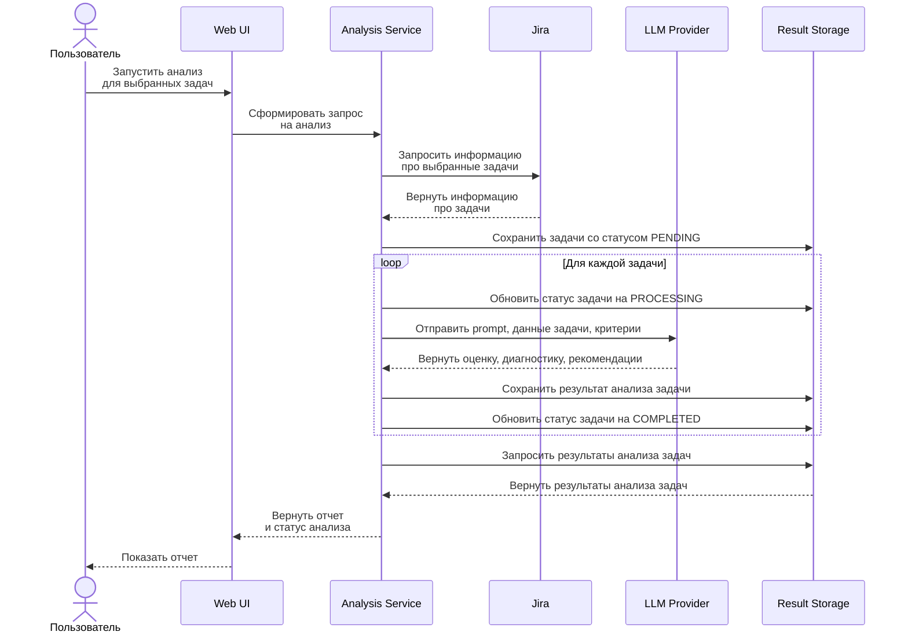

# Simplified Sequence Diagram (for Presentation)

```mermaid
sequenceDiagram
    actor User as Пользователь
    participant UI as Web UI
    participant Service as Analysis Service
    participant Jira as Jira
    participant LLM as LLM Provider
    participant DB as Result Storage

    User->>UI: Запустить анализ<br>для выбранных задач

    UI->>Service: Сформировать запрос<br>на анализ
    Service->>Jira: Запросить информацию<br> про выбранные задачи

    Jira-->>Service: Вернуть информацию<br>про задачи

    Service->>DB: Сохранить задачи со статусом PENDING

    loop Для каждой задачи
        Service->>DB: Обновить статус задачи на PROCESSING
        Service->>LLM: Отправить prompt, данные задачи, критерии
        LLM-->>Service: Вернуть оценку, диагностику, рекомендации
        Service->>DB: Сохранить результат анализа задачи
        Service->>DB: Обновить статус задачи на COMPLETED
    end

    Service->>DB: Запросить результаты анализа задач
    DB-->>Service: Вернуть результаты анализа задач

    Service-->>UI: Вернуть отчет<br> и статус анализа
    UI-->>User: Показать отчет

```
