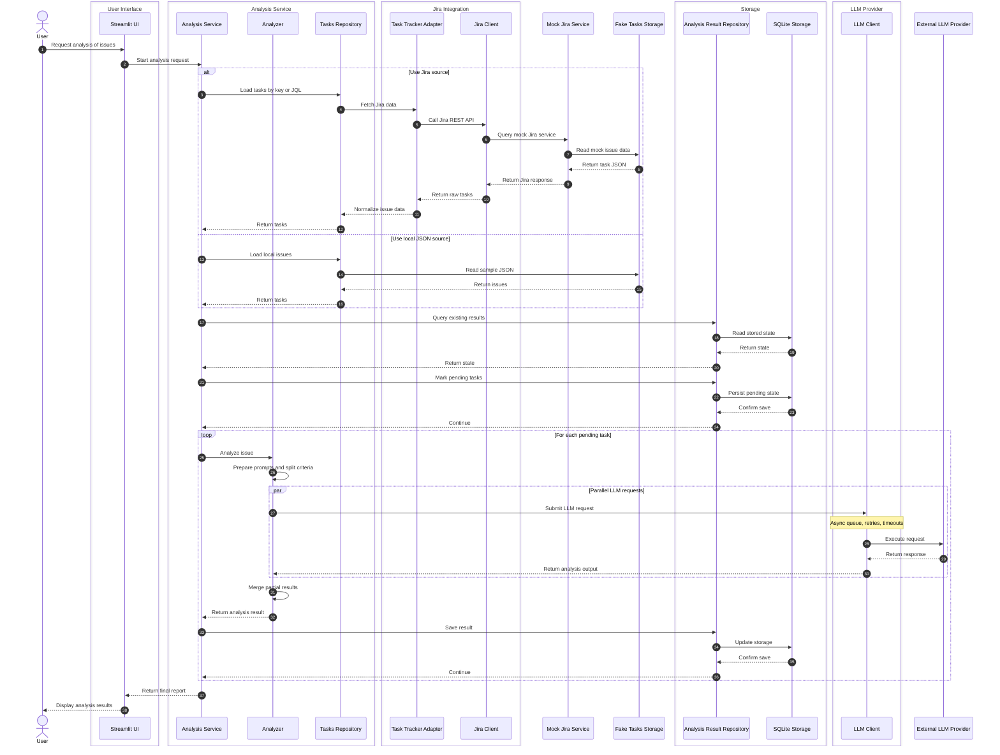

# Sequence diagram

This diagram shows the analysis flow for the Streamlit UI, including Jira data retrieval, LLM analysis, and result persistence.

```mermaid
sequenceDiagram
    autonumber

    actor User

    box User Interface
        participant UI as Streamlit UI
    end

    box Analysis Service
        participant AnalysisService as Analysis Service
        participant Analyzer as Analyzer
        participant TasksRepository as Tasks Repository
    end

    box Jira Integration
        participant TaskTrackerAdapter as Task Tracker Adapter
        participant JiraClient as Jira Client
    end

    participant MockJira as Mock Jira Service
    participant FakeTasksStorage as Fake Tasks Storage

    box Storage
        participant AnalysisResultRepo as Analysis Result Repository
        participant ResultStorage as SQLite Storage
    end

    box LLM Provider
        participant LLMClient as LLM Client
    end

    participant LLMProvider as External LLM Provider

    User->>UI: Request analysis of issues
    UI->>AnalysisService: Start analysis request

    alt Use Jira source
        AnalysisService->>TasksRepository: Load tasks by key or JQL
        TasksRepository->>TaskTrackerAdapter: Fetch Jira data
        TaskTrackerAdapter->>JiraClient: Call Jira REST API
        JiraClient->>MockJira: Query mock Jira service
        MockJira->>FakeTasksStorage: Read mock issue data
        FakeTasksStorage-->>MockJira: Return task JSON
        MockJira-->>JiraClient: Return Jira response
        JiraClient-->>TaskTrackerAdapter: Return raw tasks
        TaskTrackerAdapter-->>TasksRepository: Normalize issue data
        TasksRepository-->>AnalysisService: Return tasks
    else Use local JSON source
        AnalysisService->>TasksRepository: Load local issues
        TasksRepository->>FakeTasksStorage: Read sample JSON
        FakeTasksStorage-->>TasksRepository: Return issues
        TasksRepository-->>AnalysisService: Return tasks
    end

    AnalysisService->>AnalysisResultRepo: Query existing results
    AnalysisResultRepo->>ResultStorage: Read stored state
    ResultStorage-->>AnalysisResultRepo: Return state
    AnalysisResultRepo-->>AnalysisService: Return state

    AnalysisService->>AnalysisResultRepo: Mark pending tasks
    AnalysisResultRepo->>ResultStorage: Persist pending state
    ResultStorage-->>AnalysisResultRepo: Confirm save
    AnalysisResultRepo-->>AnalysisService: Continue

    loop For each pending task
        AnalysisService->>Analyzer: Analyze issue
        Analyzer->>Analyzer: Prepare prompts and split criteria
        par Parallel LLM requests
            Analyzer->>LLMClient: Submit LLM request
            Note over LLMClient: Async queue, retries, timeouts
            LLMClient->>LLMProvider: Execute request
            LLMProvider-->>LLMClient: Return response
            LLMClient-->>Analyzer: Return analysis output
        end
        Analyzer->>Analyzer: Merge partial results
        Analyzer-->>AnalysisService: Return analysis result
        AnalysisService->>AnalysisResultRepo: Save result
        AnalysisResultRepo->>ResultStorage: Update storage
        ResultStorage-->>AnalysisResultRepo: Confirm save
        AnalysisResultRepo-->>AnalysisService: Continue
    end

    AnalysisService-->>UI: Return final report
    UI-->>User: Display analysis results
```
