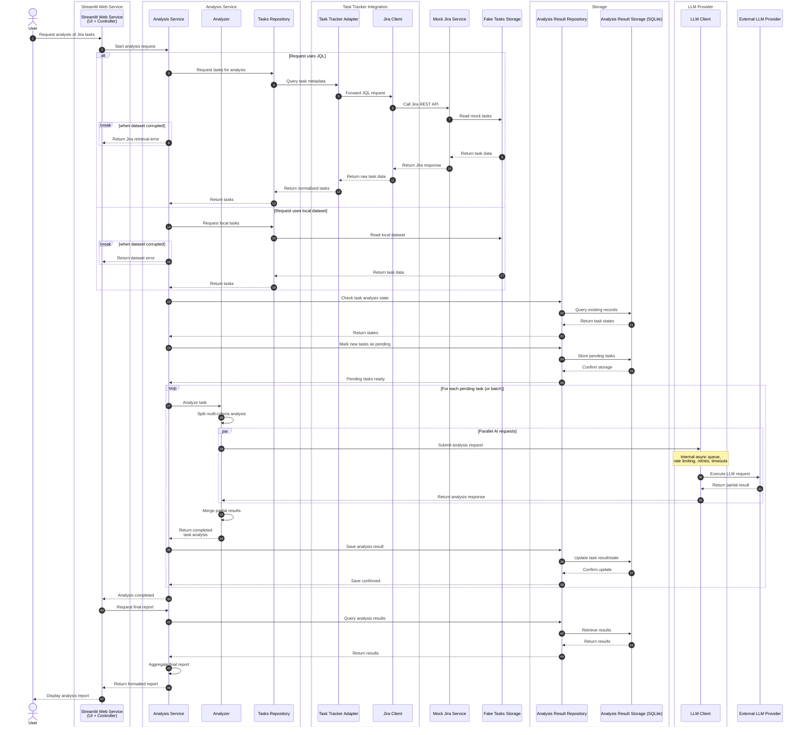

# Sequence diagram

```mermaid
sequenceDiagram
    autonumber

    actor User

    box Streamlit Web Service
        participant WebUI as Streamlit Web Service<br>(UI + Controller)
    end

    box Analysis Service
        participant AnalysisService as Analysis Service
        participant Analyzer as Analyzer
        participant TasksRepository as Tasks Repository
    end

    box Task Tracker Integration
        participant TaskTrackerAdapter as Task Tracker Adapter
        participant JiraClient as Jira Client
    end

    participant MockJira as Mock Jira Service
    participant FakeTasksStorage as Fake Tasks Storage

    box Storage
        participant AnalysisResultRepo as Analysis Result Repository
        participant ResultStorage as Analysis Result Storage (SQLite)
    end

    box LLM Provider
        participant LLMClient as LLM Client
    end

    participant LLMProvider as External LLM Provider

    %% User request

    User->>WebUI: Request analysis of Jira tasks

    WebUI->>AnalysisService: Start analysis request

    %% Task retrieval

    alt Request uses JQL
        AnalysisService->>TasksRepository: Request tasks for analysis

        TasksRepository->>TaskTrackerAdapter: Query task metadata

        TaskTrackerAdapter->>JiraClient: Forward JQL request

        JiraClient->>MockJira: Call Jira REST API

        MockJira->>FakeTasksStorage: Read mock tasks

        break when dataset corrupted
            AnalysisService-->>WebUI: Return Jira retrieval error
        end

        FakeTasksStorage-->>MockJira: Return task data

        MockJira-->>JiraClient: Return Jira response

        JiraClient-->>TaskTrackerAdapter: Return raw task data

        TaskTrackerAdapter-->>TasksRepository: Return normalized tasks

        TasksRepository-->>AnalysisService: Return tasks

    else Request uses local dataset
        AnalysisService->>TasksRepository: Request local tasks

        TasksRepository->>FakeTasksStorage: Read local dataset

        break when dataset corrupted
            AnalysisService-->>WebUI: Return dataset error
        end

        FakeTasksStorage-->>TasksRepository: Return task data

        TasksRepository-->>AnalysisService: Return tasks
    end

    %% Check already analysed tasks

    AnalysisService->>AnalysisResultRepo: Check task analysis state

    AnalysisResultRepo->>ResultStorage: Query existing records

    ResultStorage-->>AnalysisResultRepo: Return task states

    AnalysisResultRepo-->>AnalysisService: Return states

    %% Add pending tasks

    AnalysisService->>AnalysisResultRepo: Mark new tasks as pending

    AnalysisResultRepo->>ResultStorage: Store pending tasks

    ResultStorage-->>AnalysisResultRepo: Confirm storage

    AnalysisResultRepo-->>AnalysisService: Pending tasks ready

    %% Analysis loop

    loop For each pending task (or batch)

        AnalysisService->>Analyzer: Analyze task

        Analyzer->>Analyzer: Split multi-criteria analysis

        par Parallel AI requests

            Analyzer->>LLMClient: Submit analysis request

            Note over LLMClient: Internal async queue,<br/>rate limiting, retries, timeouts

            LLMClient->>LLMProvider: Execute LLM request

            LLMProvider-->>LLMClient: Return partial result

            LLMClient-->>Analyzer: Return analysis response

        end

        Analyzer->>Analyzer: Merge partial results

        Analyzer-->>AnalysisService: Return completed<br> task analysis

        %% Save result

        AnalysisService->>AnalysisResultRepo: Save analysis result

        AnalysisResultRepo->>ResultStorage: Update task result/state

        ResultStorage-->>AnalysisResultRepo: Confirm update

        AnalysisResultRepo-->>AnalysisService: Save confirmed

    end

    %% Final result retrieval

    AnalysisService-->>WebUI: Analysis completed

    WebUI->>AnalysisService: Request final report

    AnalysisService->>AnalysisResultRepo: Query analysis results

    AnalysisResultRepo->>ResultStorage: Retrieve results

    ResultStorage-->>AnalysisResultRepo: Return results

    AnalysisResultRepo-->>AnalysisService: Return results

    AnalysisService->>AnalysisService: Aggregate final report

    AnalysisService-->>WebUI: Return formatted report

    WebUI-->>User: Display analysis report
```
